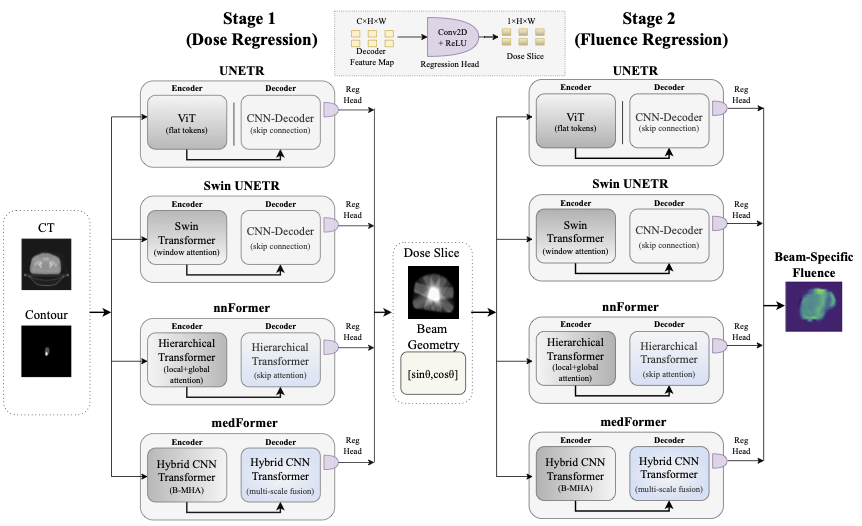

# FluenceFormer

## FluenceFormer: Transformer-Driven Multi-Beam Fluence Map Regression for Radiotherapy Planning

**Ujunwa Mgboh**, Rafi Ibn Sultan, Joshua Kim, Kundan Thind, Dongxiao Zhu  
Accepted at *MIDL, 2026*

📄 **Paper link:** Coming soon  
💻 **Code:** https://github.com/UJUNWAMGBOH/FluenceFormer  

---

FluenceFormer is a backbone-agnostic transformer framework for direct, geometry-aware multi-beam fluence regression in automated radiotherapy planning.

---

# Abstract

Fluence map prediction is central to automated radiotherapy planning but remains an ill-posed inverse problem due to the complex relationship between volumetric anatomy and beam-intensity modulation. Convolutional methods in prior work often struggle to capture long-range dependencies, which can lead to structurally inconsistent or physically unrealizable plans.

We introduce **FluenceFormer**, a backbone-agnostic transformer framework for direct, geometry-aware fluence regression. The model adopts a unified two-stage design: **Stage 1** predicts a global dose prior from anatomical inputs, and **Stage 2** conditions this prior on explicit beam geometry to regress physically calibrated fluence maps.

Central to the approach is the **Fluence-Aware Regression (FAR)** loss, a physics-informed objective integrating voxel-level fidelity, gradient smoothness, structural consistency, and beam-wise energy conservation. We evaluate the generality of the framework across multiple transformer backbones, including Swin UNETR, UNETR, nnFormer, and MedFormer, on a prostate IMRT dataset.

FluenceFormer with Swin UNETR achieves the strongest performance among evaluated models and improves over existing CNN and single-stage baselines, reducing Energy Error to **4.5%** while yielding statistically significant gains in structural fidelity (*p* < 0.05).

---

# Architecture Overview

FluenceFormer follows a two-stage geometry-aware design:

<p align="center">
  
</p>

- **Stage 1:** Global dose prior prediction from anatomical inputs (CT, contours, dose context).
- **Stage 2:** Beam-conditioned fluence regression using explicit angular encoding.
- **Loss:** Fluence-Aware Regression (FAR) enforcing physical and structural consistency.

Supported transformer backbones:

- SwinUNETR 
- UNETR
- nnFormer 
- MedFormer

---

# Key Contributions

- Backbone-agnostic transformer framework for multi-beam fluence regression
- Explicit geometry conditioning for beam-aware prediction
- Physics-informed Fluence-Aware Regression (FAR) loss
- Comprehensive backbone × loss ablation study
- Fully reproducible training and inference pipeline

---

# Installation

Clone the repository:

```bash
git clone https://github.com/UJUNWAMGBOH/FluenceFormer.git
cd FluenceFormer
```

Install dependencies:

```bash
pip install -r requirements.txt
```
Instructions for directory structure, training and evaluation can be found in instructions.md

---

# Citation

If you find this work useful in your research, please consider citing:

```bibtex
@inproceedings{fluenceformer2026,
  title={FluenceFormer: Transformer-Driven Multi-Beam Fluence Map Regression for Radiotherapy Planning},
  author={Ujunwa Mgboh, Rafi Ibn Sultan, Joshua Kim, Kundan Thind and Dongxiao Zhu},
  booktitle={Proceedings of the Medical Imaging with Deep Learning (MIDL)},
  year={2026}
}
```
